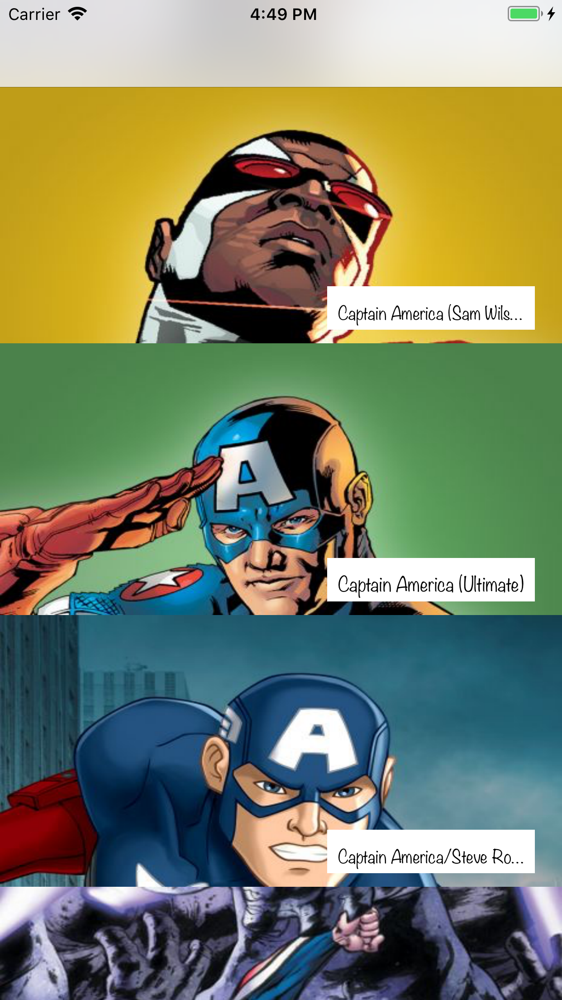

# Marvel Demo iOS Application

Example Project 2 (Work in progress...)

**Sumamry**

Demo application differing my TheMovieDatabase demo. 
Using MVC opposed to MVVM.
Using Cocoapods 

**Setup and Pods used**

The Marvel Developer guide requests API keys (understandably) be kept private. 
To generate your own API Keys register at: https://developer.marvel.com/ 
I've used CocoaPod-Keys to store the keys inside keychain. 

- gem install cocoapods-keys
- pod install (you'll be requested to enter your own keys.)

The Marvel API requires we send a hash as part of the authorisation.
"hash - a md5 digest of the ts parameter, your private key and your public key (e.g. md5(ts+privateKey+publicKey)"
To hash the concatenated string i've used the CrytoSwift framework.

**Pods**

CocoaPod-Keys: https://github.com/orta/cocoapods-keys

CrytoKeys: https://github.com/krzyzanowskim/CryptoSwift

**Initial Commit Screenshot** 

  

